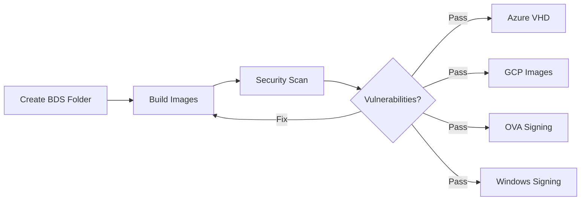

# NDM Release Workflow Guide

## Quick Start

Complete NDM release across Azure, GCP, vSphere, and Windows platforms.

---

## Prerequisites

### Before Starting Release


The release name will be in the format YYYY.MM.<Patch-version>>

Example 

2025.10.0 (release version)

2025.10.1 (patch version 1) 

2025.10.2 (patch version 2)  and so on....

### Trigger the Release Pipeline

1) Take the latest from main branch, from which the branch will be created. 
2) Create a new branch from the latest : git checkout -b release/2025.10.0 ( the branch name must be release/<YYYY.MM.PATCH>
3) Run the Release workflow(release-workflow.yaml) on this branch. 
This is an example of the workflow https://github.com/NetApp-Cloud-DataMigrate/ndm/actions/runs/18121000912 
This will create the image and run the e2e on the release branch. 

4) Once the workflow is complete, you can view the release details in artifactory - https://generic.repo.eng.netapp.com/artifactory/openlab-generic/cicd/ndm/releases/. A folder named preview must have been created. The release folder contains the following:
    1) docker/
        Contains tar files of all Docker images used in this release. Each image is tagged with the release version.

    2) helm/
        Stores Helm chart .tgz packages for this release, with charts tagged according to the release version.

    3) ova/
        Includes on-prem OVA files for deploying both the control plane and worker nodes.

    4) worker/
        Holds worker binary builds, worker environment files, and related manifests.

    5) windows-installer/
        Contains Windows installer .exe binary builds.

    6) manifests/
        Provides manifests for control plane and worker builds across Azure, GCP, vSphere, and includes the Windows installer manifest.

---

#### Create BlackDuck Scan Folder

######## Make sure while RUNNING these Workflows you have selected the RELEASE BRANCH #########

**Required for:** bds-security-scans (Step 1)

**Where:** BlackDuck UI (not Git!)

**Steps:**
1. Login to BlackDuck portal
2. Navigate to Projects
3. Find your ndm_main_docker_image, ndm_main project
4. Clone/Create new scan folder
5. **Naming convention:** 
`yyyy.mm.version_whichPreview_docker_image`,
`yyyy.mm.version_whichPreview`   respectively      

**Examples:**
- `2025.12.0_preview1_docker_image`
- `2025.12.0_preview1`

**Why needed:** 
- Isolates scan results per release
- Tracks vulnerabilities separately from main
- Required for release compliance and audit trail

## Release Sequence



**Run in order:**
1. **Create BlackDuck scan folder in BDS UI** (prerequisite)
2. **bds-security-scan** → BlackDuck Security Scan for code
3. **bds-security-docker-image-scan** → BlackDuck Security Scan for docker images
4. **Azure VHD Export + GCP Image Upload + OVA Signing + Windows Installer Signing** 

---

## Workflows

### 1. BlackDuck Security Scan (Code)
**Location:** `.github/workflows/bds-security-scan.yaml`   
**Purpose:** Scan source code for security vulnerabilities and license compliance

**Prerequisites:**
- BlackDuck scan folder created in BDS UI (see above)
- Folder name follows convention: `yyyy.mm.version_whichPreview`

**Inputs:**
```yaml
version_name: "yyyy.mm.version_whichPreview" # folder name on bds ui for code scan
branch_name: "release/preview-alpha"  # branch name on which bds scan has to run (if left empty runs on current branch)  
```

**Output:** 
BlackDuck scan results in folder: `yyyy.mm.version_whichPreview`

---

### 2. BlackDuck Docker Image Scan
**Location:** `.github/workflows/bds-security-docker-image-scan.yaml`  
**Purpose:** Scan Docker images for security vulnerabilities and compliance

**Prerequisites:**
- BlackDuck scan folder created in BDS UI (see above)
- Folder name follows convention: `yyyy.mm.version_whichPreview_docker_image`

**Inputs:**
```yaml
bds_scan_folder_name: "yyyy.mm.version_whichPreview_docker_image"  # Folder name on BlackDuck UI for docker image scan
branch_name: "release/preview-alpha"  # branch name on which bds scan has to run (if left empty runs on current branch)
```

**Output:** 
BlackDuck scan results in folder: `yyyy.mm.version_whichPreview_docker_image`

---

### 3. Azure VHD Export
**Location:** `.github/workflows/azure-image-copy-to-blob-release.yaml`  
**Purpose:** Export Azure managed images as VHD files to blob storage

**Inputs:**
```yaml

release_sig_image_id_worker: "number" # 2025.24.11173418
release_sig_image_id_controlplane: "number" # 2025.24.11172200
copy_sas_duration_hours: "time for which the copy function of copying the image to blob take"
```

**Output:** 
- sas url

---

### 4. GCP Image Upload
**Location:** `.github/workflows/gcp-image-upload-to-scratch-space.yaml`  
**Purpose:** Upload VMDK images to scratch space 

**Inputs:**
```yaml
release_worker_image_name: "ndm-worker-v1.2.3" # datamigrator-control-plane-24-11-2025-17-28-39
release_controlplane_image_name: "ndm-controlplane-v1.2.3" #datamigrator-worker-24-11-2025-17-21-59
release_folder: "preview_121"
```

**Output:** `/x/eng/NDM/preview_121/gcp/` # scratch space path
- `ndm-worker-v1.2.3-TIMESTAMP.tar.gz`
- `ndm-controlplane-v1.2.3-TIMESTAMP.tar.gz`
- `GCP_SHA256SUMS-TIMESTAMP.sha256`

---

### 5. OVA Image Signing
**Location:** `.github/workflows/ova-image-signing.yaml`  
**Purpose:** Sign OVA files with digital certificates and upload to the scratch space

**Inputs:**
```yaml
release_worker_ova_name: "ndm-worker-ova-v1.2.3" 
release_controlplane_ova_name: "ndm-controlplane-ova-v1.2.3"
release_folder: "preview_121"
artifactory_path: "releases/preview121/ova"
```

**Output:** `/x/eng/NDM/preview_release/ova/` # scratch space path
- `ndm-worker-ova-v1.2.3_signed.ova`
- `ndm-controlplane-ova-v1.2.3_signed.ova`
- `OVA_SHA256SUMS-TIMESTAMP.sha256`

---

### 6. Windows Installer Signing
**Location:** `.github/workflows/windows-installer-signing.yaml`  
**Purpose:** Sign Windows EXE installer and upload to the scratch space

**Two-Step Process:**

#### Step 1: Prepare
```yaml
windows_installer_name: "ndm-windows-worker-v1.2.3"
release_folder: "preview_release"
artifactory_path: "releases/preview/windows-installer"
workflow_step: "prepare_for_signing"
enable_auto_signing: false  # true for automated
```

**Manual:** RDP to Windows server and run signtool command (shown in output)  
**Auto:** Signing happens automatically via SSH

#### Step 2: Checksum
```yaml
workflow_step: "post_signing_checksum"
windows_installer_name: "ndm-windows-worker-v1.2.3"  # Same as Step 1
release_folder: "preview_release"  # Same as Step 1
```

**Output:** `/x/eng/NDM/preview_release/windows/` # scratch space path
- `ndm-windows-worker-v1.2.3_signed.exe`
- `WINDOWS_SHA256SUMS-TIMESTAMP.sha256`

---

## Post-Release Checklist

### 1. Verify Artifacts
```bash
ssh cyclortp7.rtp.openeng.netapp.com
cd /x/eng/NDM/preview_release/

# Check all files
ls -R azure/ gcp/ ova/ windows/

# Verify checksums
cd azure && sha256sum -c AZURE_SHA256SUMS-*.sha256
cd ../gcp && sha256sum -c GCP_SHA256SUMS-*.sha256
cd ../ova && sha256sum -c OVA_SHA256SUMS-*.sha256
cd ../windows && sha256sum -c WINDOWS_SHA256SUMS-*.sha256
```

### 2. Coordinate NSS Upload
This is a manual step in order to upload to NSS for the Below Confluence

https://confluence.ngage.netapp.com/spaces/CDMT/pages/1256682983/NSS+Posting
---
