# ADS Implementation - Detailed Technical Documentation

## Overview
This document provides a comprehensive technical overview of the Alternate Data Streams (ADS) implementation in NDM using temporal workflows. The implementation follows NDM's existing patterns and leverages its temporal infrastructure for reliable, scalable ADS processing.

## Architecture Overview

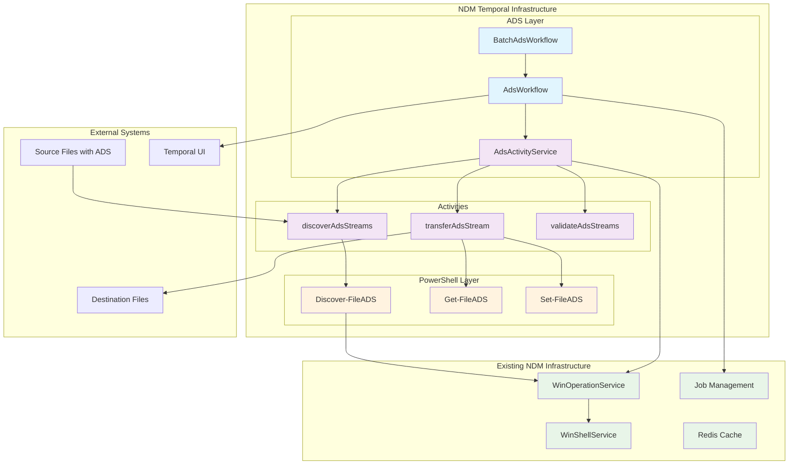

### System Architecture Layers

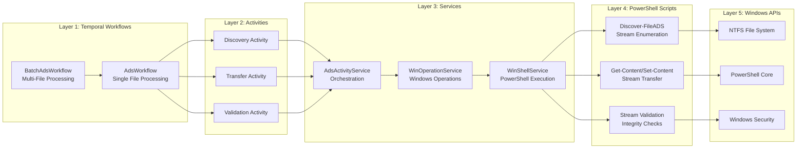

## Core Components

### 1. ADS Activity Service (`ads-activity.service.ts`)

**Purpose**: Provides temporal activities for ADS operations
**Location**: `services/worker/src/activities/core/ads/ads-activity.service.ts`

#### Key Methods:

##### `discoverAdsStreams(input: AdsDiscoveryInput): Promise<AdsDiscoveryOutput>`
```typescript
// Discovers ADS streams for a file using WinOperationService
const adsResult = await this.winOperationService.discoverAdsForFile(input.filePath);
return {
  fileId: adsResult.fileId,
  filePath: adsResult.filePath,
  streamCount: adsResult.streamCount,
  totalSize: adsResult.totalAdsSize,
  requiresProcessing: adsResult.streamCount > 0
};
```

##### `transferAdsStream(input: AdsTransferInput): Promise<AdsTransferOutput>`
```typescript
// Transfers a single ADS stream using PowerShell
const transferScript = `
  $ErrorActionPreference = 'Stop'
  try {
    $source = "${input.filePath.replace(/"/g, '`"')}"
    $dest = "${input.destinationPath.replace(/"/g, '`"')}"
    $streamName = "${input.streamName}"
    
    # Read source ADS content
    $content = Get-Content -Path $source -Stream $streamName -Raw
    $size = (Get-Item $source -Stream $streamName).Length
    
    # Write to destination ADS
    Set-Content -Path $dest -Stream $streamName -Value $content
    
    # Verify transfer
    $destStream = Get-Item $dest -Stream $streamName
    if ($destStream.Length -ne $size) {
      throw "Transfer verification failed"
    }
    
    Write-Output "SUCCESS:$size"
  } catch {
    Write-Output "ERROR:$($_.Exception.Message)"
  }
`;
```

##### `validateAdsStreams(input: AdsValidationInput): Promise<AdsValidationOutput>`
```typescript
// Validates that expected ADS streams exist at destination
for (const streamName of input.expectedStreams) {
  // Check existence and integrity of each stream
}
```

**Integration Points**:
- Uses `WinOperationService` for PowerShell execution
- Follows NDM's error handling patterns
- Leverages existing logging infrastructure

### 2. ADS Workflows (`ads-workflow.ts`)

**Purpose**: Orchestrates ADS processing using temporal workflows
**Location**: `services/worker/src/workflows/core/ads/ads-workflow.ts`

#### AdsWorkflow - Single File Processing

```typescript
export const AdsWorkflow = async ({
  traceId,
  filePath,
  destinationPath,
  options = {},
}: AdsWorkflowInput): Promise<AdsWorkflowOutput> => {
```

**Workflow Steps**:

1. **Discovery Phase**
   ```typescript
   // Check if file has ADS streams
   const hasAds = await shouldProcessAdsActivity(filePath);
   if (!hasAds) return completed_output;
   
   // Discover all ADS streams
   const discoveryResult = await discoverAdsStreamsActivity({ filePath });
   ```

2. **Transfer Phase**
   ```typescript
   // Transfer each discovered stream
   for (const streamName of streamNames) {
     const transferResult = await transferAdsStreamActivity({
       filePath,
       destinationPath,
       streamName,
       options: { validateChecksum: true, chunkSize: 10 * 1024 * 1024 }
     });
   }
   ```

3. **Validation Phase**
   ```typescript
   // Validate transferred streams if requested
   if (options.validateTransfer && output.streamsTransferred > 0) {
     const validationResult = await validateAdsStreamsActivity({
       filePath,
       destinationPath,
       expectedStreams: streamNames
     });
   }
   ```

4. **Status Reporting**
   ```typescript
   // Update job status through NDM's job management
   await updateJobStatusActivity({ 
     jobRunId: traceId, 
     status: output.status
   });
   ```

#### BatchAdsWorkflow - Multi-File Processing

```typescript
export const BatchAdsWorkflow = async ({
  traceId,
  filePaths,
  destinationBasePath,
  options = {},
}: BatchAdsWorkflowInput): Promise<BatchAdsWorkflowOutput> => {
```

**Features**:
- **Concurrency Control**: Process files in batches with configurable concurrency
- **Child Workflows**: Each file processed as separate workflow for isolation
- **Progress Tracking**: Aggregate results from all file workflows

```typescript
// Process files in batches to control concurrency
for (let i = 0; i < filePaths.length; i += maxConcurrency) {
  const batch = filePaths.slice(i, i + maxConcurrency);
  
  for (const filePath of batch) {
    const filePromise = wf.executeChild(AdsWorkflow, {
      args: [{ traceId: `${traceId}-file-${i}`, filePath, destinationPath }],
      workflowId: `ads-${traceId}-${i}`,
    });
    filePromises.push(filePromise);
  }
  
  // Wait for current batch to complete
  const batchResults = await Promise.allSettled(filePromises);
}
```

### 3. WinOperationService Integration

**Purpose**: Provides ADS discovery and validation within existing ACL operations
**Location**: `services/worker/src/activities/core/migrate/command-execution/win-opeartions/win-operation.service.ts`

#### `discoverAdsForFile(filePath: string): Promise<AdsDiscoveryResult>`

```typescript
async discoverAdsForFile(filePath: string): Promise<AdsDiscoveryResult> {
  try {
    const script = `$srcFile = '${filePath.replace(/'/g, "''")}'\nDiscover-FileADS $srcFile`;
    const output = await this.winShellService.executeCommand(script);
    
    const streamMetadata: AdsStreamMetadata[] = JSON.parse(output.stdout) || [];
    const totalAdsSize = streamMetadata.reduce((sum, stream) => sum + stream.size, 0);
    
    return {
      fileId: this.generateFileId(filePath),
      filePath,
      streamCount: streamMetadata.length,
      totalAdsSize,
      streams: streamMetadata,
      estimatedTotalTime: streamMetadata.reduce((sum, stream) => sum + stream.estimatedTransferTime, 0),
      requiresSpecialHandling: false // Temporal handles all sizes
    };
  } catch (error) {
    this.logger.error(`Failed to discover ADS for ${filePath}: ${error.message}`);
    return { /* empty result */ };
  }
}
```

**Integration with ACL Operations**:
```typescript
// ADS validation integrated into existing ACL validation
const sourceAds = acl1.AdsStreams || [];
const targetAds = acl2.AdsStreams || [];

// Validate each source ADS exists in target with matching content
for (const srcAds of sourceAds) {
  const found = targetAds.some(tgtAds =>
    tgtAds.StreamName === srcAds.StreamName &&
    tgtAds.Content === srcAds.Content &&
    tgtAds.IsBinary === srcAds.IsBinary
  );
  if (!found) {
    output.inValid += `Missing ADS in target: Stream(${srcAds.StreamName})`;
  }
}
```

### 4. PowerShell Scripts (`powershell.script.ts`)

**Purpose**: Low-level PowerShell functions for ADS operations
**Location**: `services/worker/src/activities/core/migrate/command-execution/win-opeartions/powershell.script.ts`

#### `Discover-FileADS` Function

```powershell
function Discover-FileADS([string]$path) {
    $adsMetadata = @()
    
    try {
        # Get all streams excluding main data stream
        $streams = Get-Item -LiteralPath $path -Stream * -ErrorAction SilentlyContinue | 
                   Where-Object { $_.Stream -ne ':$DATA' -and $_.Stream -ne '' }
        
        foreach ($stream in $streams) {
            # Type estimation based on stream name and size
            $estimatedType = 'unknown'
            $priority = 'normal'
            
            # Heuristic detection
            switch -Regex ($stream.Stream) {
                '(?i)(thumb|icon|image)' { 
                    $estimatedType = 'binary'; $priority = 'low' 
                }
                '(?i)(security|manifest|signature)' { 
                    $estimatedType = 'binary'; $priority = 'critical' 
                }
                '(?i)(meta|desc|comment|author)' { 
                    $estimatedType = 'text'; $priority = 'normal' 
                }
                '(?i)(zone\.identifier|quarantine)' { 
                    $priority = 'low' # System streams
                }
                default { 
                    if ($stream.Length -lt 1024) { $estimatedType = 'text' }
                    elseif ($stream.Length -gt 1048576) { $estimatedType = 'binary' }
                }
            }
            
            # Estimate transfer time (rough calculation)
            $estimatedTransferTime = [math]::Max(100, $stream.Length / 10240)
            
            $adsMetadata += [PSCustomObject]@{
                StreamName = $stream.Stream
                Size = $stream.Length
                EstimatedType = $estimatedType
                Priority = $priority
                EstimatedTransferTime = $estimatedTransferTime
            }
        }
    } catch {
        # Return empty array on discovery failure
    }
    
    return $adsMetadata
}
```

#### Simple Get/Set Functions (for ACL compatibility)

```powershell
function Get-FileADS([string]$path) {
    # Basic ADS enumeration for ACL operations
    $streams = Get-Item -LiteralPath $path -Stream * -ErrorAction SilentlyContinue | 
               Where-Object { $_.Stream -ne ':$DATA' }
    return $streams | ConvertTo-Json -Depth 3
}

function Set-FileADS([string]$path, [string]$streamName, [string]$content) {
    # Simple ADS setter for ACL operations
    Set-Content -Path $path -Stream $streamName -Value $content
}
```

## Module Integration

### Activity Registration (`activities.module.ts`)

```typescript
@Module({
  providers: [
    // ... existing activities
    AdsActivityService,  // ← New ADS activities
    // ... other activities
  ],
  exports: [
    // ... existing exports  
    AdsActivityService,  // ← Export for temporal worker
    // ... other exports
  ]
})
export class ActivitiesModule {}
```

### Workflow Export (`workflows.ts`)

```typescript
export * from './core/migrate/sync-workflow';
export * from './core/ads/ads-workflow';  // ← Export ADS workflows
```

## Data Flow

### 1. ADS Processing Flow - Single File

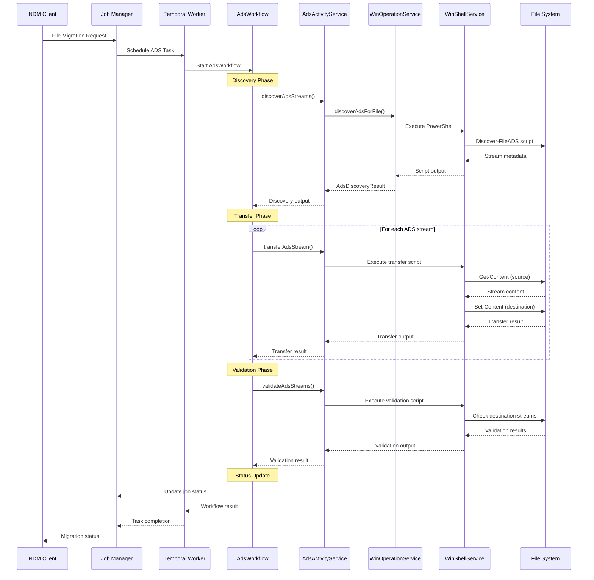

### 2. Batch Processing Flow

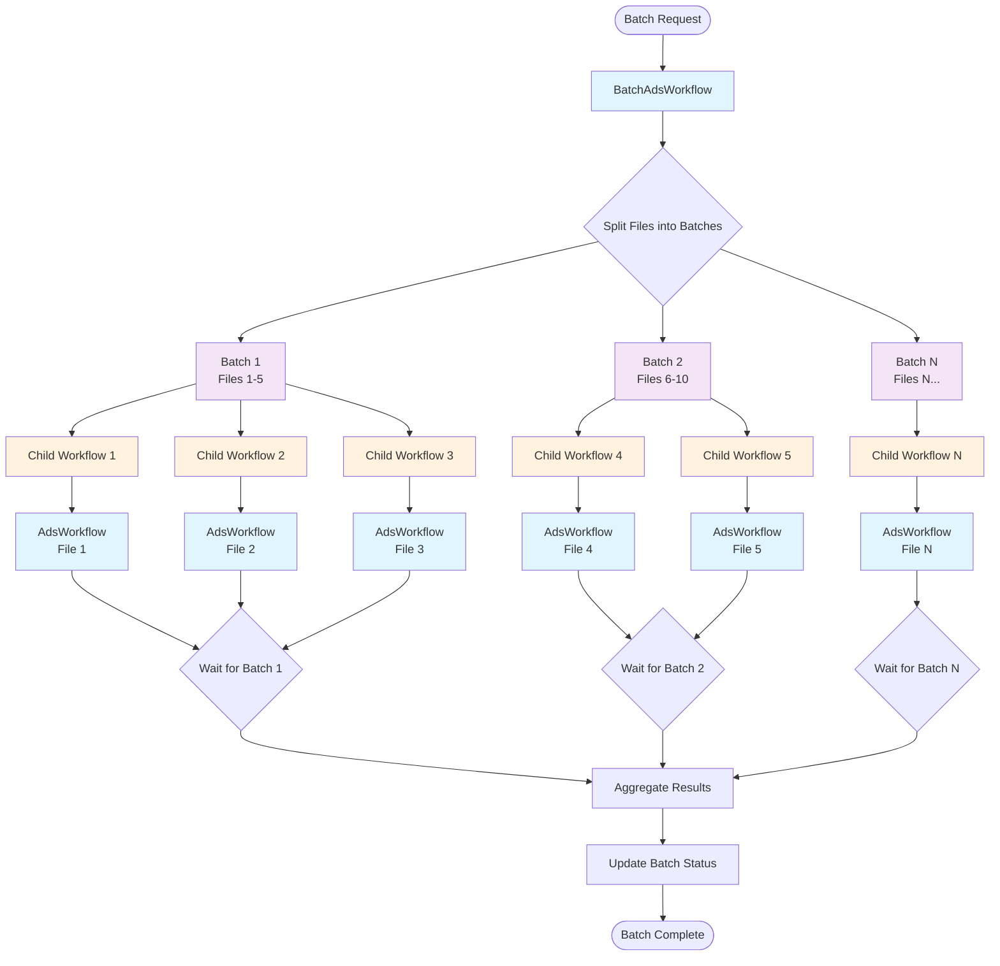

### 3. Error Handling and Retry Flow

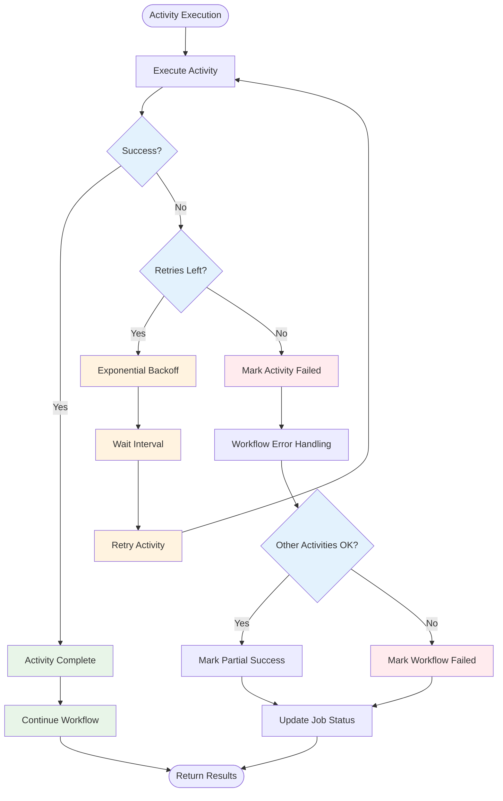

### 4. Component Interaction Diagram

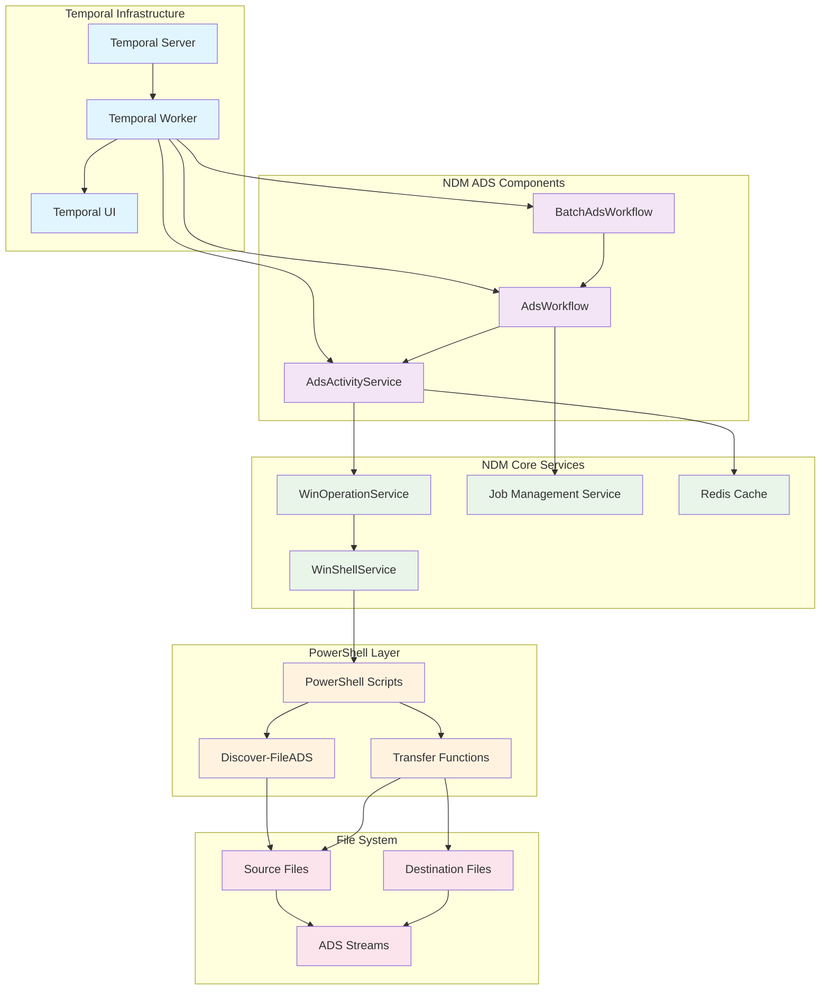

## Configuration

### Temporal Configuration Architecture

```mermaid
graph TB
    subgraph "Workflow Configuration"
        WC[Workflow Config]
        WTO[Workflow Timeout<br/>1 hour max]
        WTT[Task Timeout<br/>10 seconds]
        WID[Workflow ID<br/>ads-{traceId}-{index}]
        
        WC --> WTO
        WC --> WTT
        WC --> WID
    end
    
    subgraph "Activity Configuration"
        AC[Activity Config]
        STCT[Start-to-Close<br/>10 minutes]
        HT[Heartbeat<br/>1 minute]
        RC[Retry Config]
        
        AC --> STCT
        AC --> HT
        AC --> RC
    end
    
    subgraph "Retry Configuration"
        RC --> MA[Max Attempts: 3]
        RC --> II[Initial Interval: 10s]
        RC --> BC[Backoff Coefficient: 2.0]
        RC --> MI[Max Interval: 5m]
        RC --> NRET[Non-Retryable:<br/>ApplicationFailure]
    end
    
    subgraph "Batch Configuration"
        BatchC[Batch Config]
        BatchC --> Conc[Max Concurrency: 5]
        BatchC --> Size[Batch Size: 10 files]
        BatchC --> Val[Validate Transfer: true]
        BatchC --> Pri[Priority Processing]
    end
    
    classDef config fill:#e8f5e8
    classDef timeout fill:#fff3e0
    classDef retry fill:#ffebee
    classDef batch fill:#e1f5fe
    
    class WC,AC,RC,BatchC config
    class WTO,WTT,STCT,HT timeout
    class MA,II,BC,MI,NRET retry
    class Conc,Size,Val,Pri batch
```

### Configuration Flow

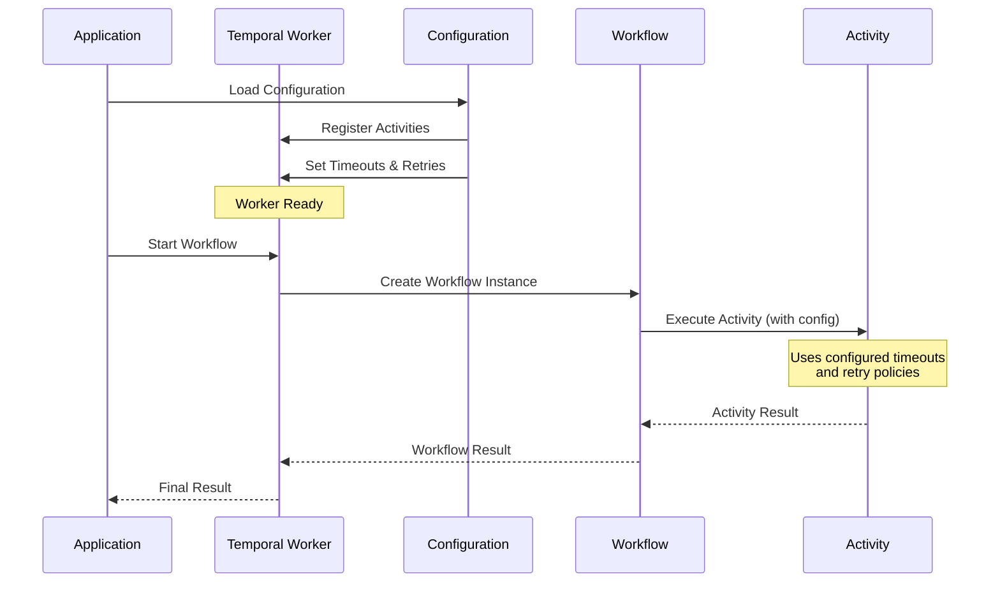

### Temporal Activity Configuration

```typescript
const adsActivities = wf.proxyActivities<AdsActivityService>({
  startToCloseTimeout: '10m',      // Max 10 minutes per activity
  heartbeatTimeout: '1m',          // Heartbeat every minute
  retry: {
    maximumAttempts: 3,            // Retry failed activities up to 3 times
    initialInterval: '10s',        // Wait 10s before first retry
    backoffCoefficient: 2.0,       // Double wait time each retry
    maximumInterval: '5m',         // Max 5 minute wait between retries
    nonRetryableErrorTypes: ['ApplicationFailure']  // Don't retry app errors
  }
});
```

### Workflow Configuration

```typescript
// Child workflow options for batch processing
const filePromise = wf.executeChild(AdsWorkflow, {
  args: [{ traceId, filePath, destinationPath, options }],
  workflowId: `ads-${traceId}-${fileIndex}`,
  workflowExecutionTimeout: '1h',  // Max 1 hour per file
  workflowTaskTimeout: '10s',      // Task processing timeout
});
```

## Testing and Monitoring

### Testing Architecture

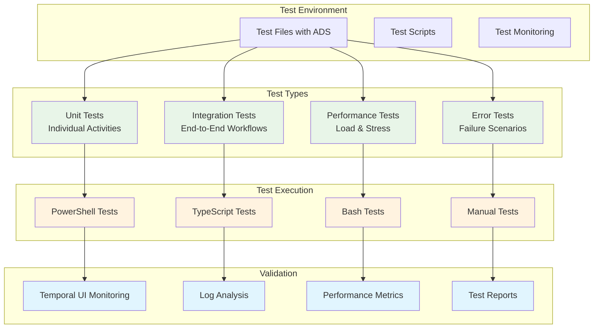

### Monitoring and Observability

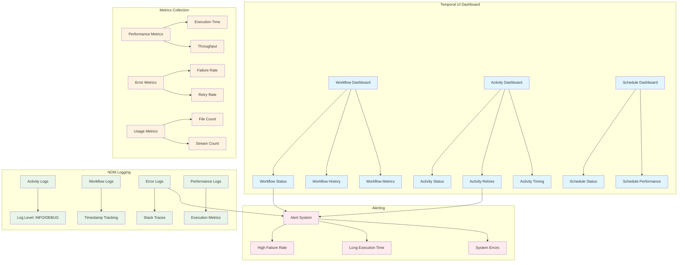

### Test Scripts

1. **PowerShell Test** (`test-ads-workflows.ps1`)
   ```powershell
   # Create test files with ADS
   # Trigger temporal workflows
   # Monitor execution via Temporal UI
   ```

2. **TypeScript Test** (`test-ads-integration.ts`)
   ```typescript
   // Integration tests for activities
   // Workflow execution tests
   // Error scenario testing
   ```

3. **Bash Test** (`test-ads-performance.sh`)
   ```bash
   # Performance and load testing
   # Concurrent workflow execution
   # Resource utilization monitoring
   ```

### Monitoring via Temporal UI

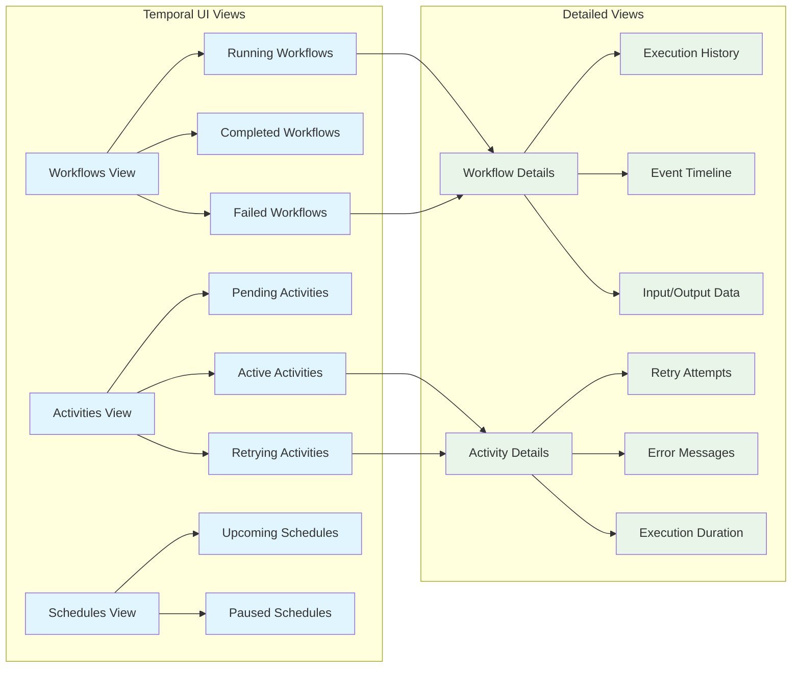

- **Workflow Execution**: Monitor `AdsWorkflow` and `BatchAdsWorkflow` execution
- **Activity Details**: View individual activity results and retry attempts  
- **Error Tracking**: Detailed error logs and stack traces
- **Performance Metrics**: Execution time, retry rates, success/failure ratios

### Logging Integration

```typescript
// Activity logging
this.logger.log(`Discovering ADS streams for: ${input.filePath}`);
this.logger.error(`Failed to transfer ADS stream ${streamName}:`, error);

// Workflow logging (via temporal)
wf.log.info(`Started ADS processing for ${filePath}`);
wf.log.error(`Workflow failed: ${error.message}`);
```

## Performance Characteristics

### Performance Architecture

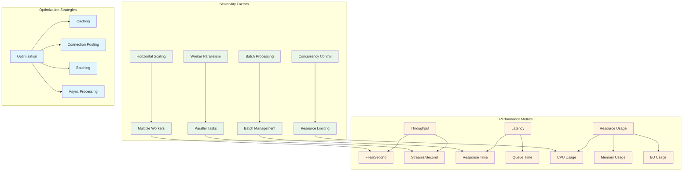

### Scalability Model

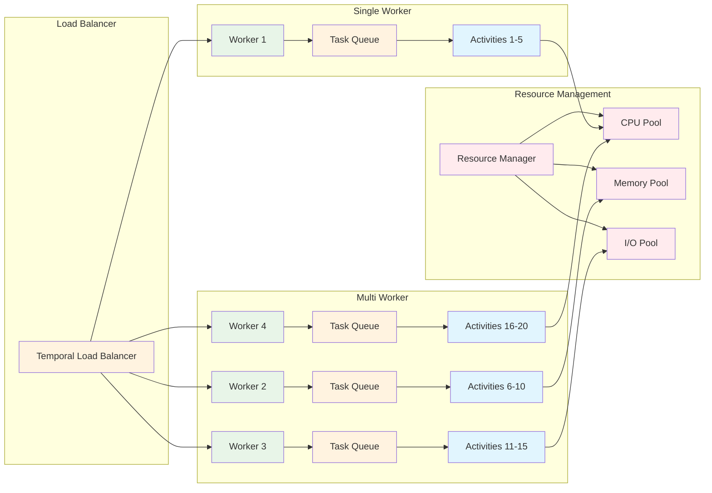

### Reliability Architecture

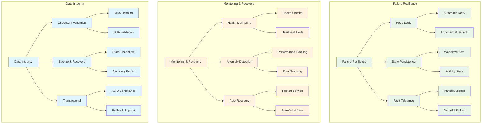

### Scalability
- **Horizontal Scaling**: Multiple temporal workers can process ADS tasks in parallel
- **Batch Processing**: Configurable concurrency for multi-file operations
- **Resource Management**: Temporal handles task distribution and load balancing

### Reliability
- **Retry Logic**: Automatic retry on transient failures
- **State Persistence**: Temporal maintains workflow state across failures
- **Partial Success**: Individual file failures don't affect batch processing
- **Monitoring**: Full visibility into execution via Temporal UI

### Integration Benefits
- **Existing Infrastructure**: Leverages NDM's PowerShell, logging, and job management
- **Consistent Patterns**: Follows established NDM temporal workflow patterns
- **Minimal Overhead**: Simple discovery-only approach with temporal handling complexity

## Future Enhancements

### Enhancement Roadmap

```mermaid
timeline
    title ADS Implementation Enhancement Roadmap
    
    section Phase 1 : Current Implementation
        Basic ADS Processing    : Temporal workflows
                               : PowerShell integration
                               : Error handling
                               : Basic monitoring
        
    section Phase 2 : Validation & Security
        Checksum Validation     : MD5/SHA256 hashing
                               : Content integrity checks
                               : Transfer verification
        Enhanced Security       : Encrypted transfers
                               : Access control validation
                               : Audit logging
                               
    section Phase 3 : Performance & Scale
        Compression Support     : Binary stream compression
                               : Compression algorithms
                               : Size optimization
        Parallel Processing     : Stream-level parallelism
                               : Multi-threaded transfers
                               : Load balancing
                               
    section Phase 4 : Advanced Features
        Incremental Transfer    : Resumable transfers
                               : Delta synchronization
                               : Bandwidth optimization
        Content Analysis        : Intelligent filtering
                               : Type detection
                               : Priority processing
                               
    section Phase 5 : Enterprise Features
        Advanced Monitoring     : Real-time dashboards
                               : Predictive analytics
                               : Automated optimization
        Cloud Integration       : Multi-cloud support
                               : Hybrid deployments
                               : Global distribution
```

### Enhancement Architecture

```mermaid
graph TB
    subgraph "Current Implementation"
        CI[Current ADS System]
        CI --> BW[Basic Workflows]
        CI --> PA[PowerShell Activities]
        CI --> SM[Simple Monitoring]
    end
    
    subgraph "Phase 2: Validation & Security"
        P2[Phase 2 Enhancements]
        P2 --> CV[Checksum Validation]
        P2 --> ES[Enhanced Security]
        P2 --> AL[Audit Logging]
        
        CV --> MD5[MD5 Hashing]
        CV --> SHA[SHA256 Validation]
        
        ES --> ENC[Encryption]
        ES --> ACL[Access Control]
        
        AL --> AT[Audit Trails]
        AL --> CR[Compliance Reports]
    end
    
    subgraph "Phase 3: Performance & Scale"
        P3[Phase 3 Enhancements]
        P3 --> COMP[Compression]
        P3 --> PAR[Parallel Processing]
        P3 --> OPT[Optimization]
        
        COMP --> GZIP[GZIP Compression]
        COMP --> LZ4[LZ4 Algorithm]
        
        PAR --> MT[Multi-Threading]
        PAR --> LB[Load Balancing]
        
        OPT --> CACHE[Intelligent Caching]
        OPT --> PRED[Predictive Scaling]
    end
    
    subgraph "Phase 4: Advanced Features"
        P4[Phase 4 Enhancements]
        P4 --> IT[Incremental Transfer]
        P4 --> CA[Content Analysis]
        P4 --> AI[AI/ML Integration]
        
        IT --> RT[Resumable Transfer]
        IT --> DELTA[Delta Sync]
        
        CA --> TD[Type Detection]
        CA --> IF[Intelligent Filtering]
        
        AI --> PA_AI[Pattern Analysis]
        AI --> AO[Auto Optimization]
    end
    
    subgraph "Phase 5: Enterprise"
        P5[Phase 5 Enhancements]
        P5 --> AM[Advanced Monitoring]
        P5 --> CI_Cloud[Cloud Integration]
        P5 --> GS[Global Scale]
        
        AM --> RTD[Real-time Dashboards]
        AM --> PRED_A[Predictive Analytics]
        
        CI_Cloud --> MC[Multi-Cloud]
        CI_Cloud --> HYB[Hybrid Deployment]
        
        GS --> GEO[Geo-distribution]
        GS --> CDN[CDN Integration]
    end
    
    CI --> P2
    P2 --> P3
    P3 --> P4
    P4 --> P5
    
    classDef current fill:#e8f5e8
    classDef phase2 fill:#fff3e0
    classDef phase3 fill:#e1f5fe
    classDef phase4 fill:#f3e5f5
    classDef phase5 fill:#ffebee
    
    class CI,BW,PA,SM current
    class P2,CV,ES,AL,MD5,SHA,ENC,ACL,AT,CR phase2
    class P3,COMP,PAR,OPT,GZIP,LZ4,MT,LB,CACHE,PRED phase3
    class P4,IT,CA,AI,RT,DELTA,TD,IF,PA_AI,AO phase4
    class P5,AM,CI_Cloud,GS,RTD,PRED_A,MC,HYB,GEO,CDN phase5
```

### Detailed Enhancement Features

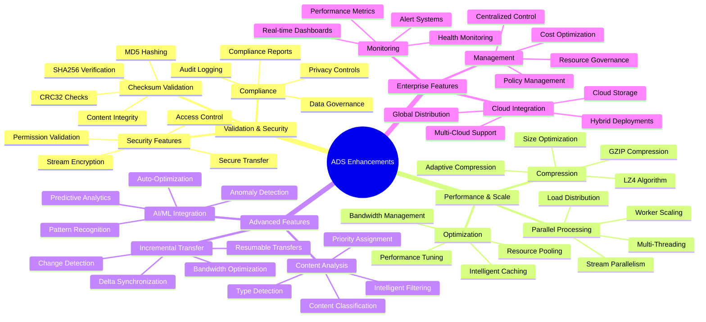

### Implementation Priorities

1. **Phase 2 - Validation & Security** (Next 3 months)
   - **Checksum Validation**: Add MD5/SHA256 validation for transferred streams
   - **Enhanced Security**: Implement encrypted transfers and access validation
   - **Audit Logging**: Comprehensive audit trails for compliance

2. **Phase 3 - Performance & Scale** (Months 4-6)
   - **Compression**: Implement compression for large binary streams
   - **Parallel Processing**: Stream-level parallelism for faster transfers
   - **Performance Optimization**: Advanced caching and optimization

3. **Phase 4 - Advanced Features** (Months 7-12)
   - **Incremental Transfer**: Support resumable transfers for large streams
   - **Content Analysis**: More sophisticated stream filtering based on content analysis
   - **AI/ML Integration**: Intelligent optimization and anomaly detection

4. **Phase 5 - Enterprise Features** (Year 2+)
   - **Advanced Monitoring**: Real-time dashboards and predictive analytics
   - **Cloud Integration**: Multi-cloud support and global distribution
   - **Enterprise Management**: Centralized control and governance

## Conclusion

This implementation provides a robust, scalable foundation for ADS processing that integrates seamlessly with NDM's existing architecture while providing the reliability and monitoring capabilities of temporal workflows. The detailed Mermaid diagrams illustrate the comprehensive architecture, data flows, and future enhancement roadmap, making it easy to understand the system's design and evolution path.