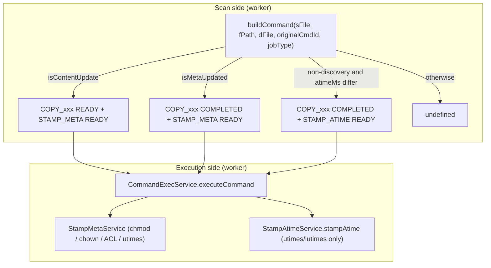

# Propagate Change in Atime — Implementation Plan

> Status: Draft (plan only — no code changes yet)
> Owner: Worker / Migrate-scan
> Related OpenSpec change (in-place extension target): [`openspec/changes/update-atime-on-incremental-cutover/`](../../openspec/changes/update-atime-on-incremental-cutover/)

## 1. Goal

Propagate any change in **access time** from source to destination during **migration**, **incremental migration**, and **cutover** flows (never during **discovery**), for both **SMB** and **NFS** workers, across **files**, **directories**, and **symlinks**, with a new dedicated atime-only operation so the path is cheap when nothing else changed.

## 2. Requirements traceability

| # | Requirement | How the plan addresses it |
|---|-------------|---------------------------|
| R1 | Access time maintained between source and destination | New scan-side branch + new `STAMP_ATIME` execution op |
| R2 | Migrated during migration and cutover; not during discovery | Existing `jobType !== 'DISCOVER'` gate preserved at scan |
| R3 | Performant — only restamp when `src.atimeMs !== dest.atimeMs` | Strict `atimeMs` check at scan; defensive re-check at execution |
| R4 | New command to set access time only on destination | New `OPS_CMD.STAMP_ATIME` + `StampAtimeService` (no chmod/chown/ACL) |
| R5 | Does not impact `preserveAccessTime` (source preservation) | Gate is independent of the option; preservation still runs in parallel inside the new op when enabled |
| R6 | Atime change only checked when content unchanged AND metadata not stamped this run | Scan branch order: `isContentUpdate` → `isMetaUpdated` → atime; mutually exclusive emission |
| R7 | SMB and NFS | TS worker dispatches by `process.platform`; `utimes`/`lutimes` works on both; `go-smb-worker/` is README-only and out of scope |
| R8 | Existing coding style | Match per-file indentation, NestJS DI, `LoggerFactory`, `dmError`/`publishToErrorStream`, `@Timed` metrics |

## 3. Background — current state

- **Scan side**: [services/worker/src/activities/core/shared/command-generation.service.ts](../../services/worker/src/activities/core/shared/command-generation.service.ts) `buildCommand` (lines 455–525) already has a 3rd branch (lines 503–522) that emits a command when `src.atimeMs !== dst.atimeMs` and `jobType !== 'DISCOVER'`. It currently emits `OPS_CMD.STAMP_META`, which redoes chmod/chown/ACL on execution.
- **Execution side**: [services/worker/src/activities/core/migrate/command-execution/stamp-meta.service.ts](../../services/worker/src/activities/core/migrate/command-execution/stamp-meta.service.ts) `stampMetaData` (lines 28–86) runs chmod + chown/lchown + ACL (Win) + `utimes`/`lutimes`. The actual atime/mtime call is `stampAccessAndModifiedTime` (lines 137–154).
- **Op enum**: [lib/jobs-lib/src/types/enums.ts](../../lib/jobs-lib/src/types/enums.ts) lines 10–18 defines `OPS_CMD` (`STAMP_META = 'sm'`, etc.). There is no atime-only op.
- **Helpers**: `isContentUpdate` / `isMetaUpdated` in [services/worker/src/activities/utils/utils.ts](../../services/worker/src/activities/utils/utils.ts) (lines 175–178); `isMetaUpdated` compares `ctimeMs` with a 1000 ms tolerance, ignoring atime.
- **Job types**: `DISCOVER` / `MIGRATE` / `CUT_OVER` strings live in [services/jobs-service/src/constants/enums.ts](../../services/jobs-service/src/constants/enums.ts) (lines 37–43) and [services/worker/src/activities/common/enums.ts](../../services/worker/src/activities/common/enums.ts).
- **Go SMB worker**: [go-smb-worker/README.md](../../go-smb-worker/README.md) only — no Go implementation to change.
- **E2E**: Ginkgo v2 + Gomega under [ndm-api-tests/](../../ndm-api-tests/); per-protocol via `--protocol_type=SMB|NFS`. Lifecycle drivers live in [ndm-api-tests/utils/jobs.go](../../ndm-api-tests/utils/jobs.go) (`CreateDiscoveryJob`, `CreateMigrationJob`, `CreateBulkCutoverJob`, `WaitForJobState`). Pattern reference for an atime helper: [ndm-api-tests/utils/permissions_manager.go](../../ndm-api-tests/utils/permissions_manager.go).

## 4. Design

### 4.1 Command flow



The split keeps atime-only restamps to a single `utimes`/`lutimes` syscall on destination — no permission, ownership, ACL, or stat-cache churn.

### 4.2 New enum value

`lib/jobs-lib/src/types/enums.ts`:

```typescript
export enum OPS_CMD {
  COPY_CONTENT = 'cc',
  STAMP_META  = 'sm',
  STAMP_ATIME = 'sa',
  COPY_FILE = 'cf',
  COPY_DIR = 'cd',
  REMOVE_DIR = 'rd',
  REMOVE_FILE = 'rf',
  COPY_SYMLINK = 'cs',
}
```

### 4.3 Scan branch refactor

In `command-generation.service.ts` `buildCommand`, replace lines 503–522 with an emission of `STAMP_ATIME`:

```typescript
if (
  jobType !== undefined &&
  jobType !== 'DISCOVER' &&
  dFile &&
  sFile.atimeMs !== dFile.atimeMs
) {
  const isDirectory = sFile.isDirectory();
  return new Cmd(
    uuid4(),
    fPath,
    CommandStatus.READY,
    isDirectory,
    {
      [this.getOpsCommand(isDirectory, metadata.isSymLink)]: { status: OPS_STATUS.COMPLETED, params: { targetExisted } },
      [OPS_CMD.STAMP_ATIME]: { status: OPS_STATUS.READY, params: {} }
    },
    metadata,
    originalCommandId
  );
}
```

Order remains: content update → metadata update → atime-only → undefined. This satisfies R6 by construction.

### 4.4 New execution service

New file `services/worker/src/activities/core/migrate/command-execution/stamp-atime.service.ts`:

- `@Injectable()` `StampAtimeService.stampAtime(input: CommandExecInput): Promise<CommandOutput>`
- Gate: `command.ops[OPS_CMD.STAMP_ATIME]` present and `!== OPS_STATUS.COMPLETED`
- **Defensive re-check (R3)**: `fs.promises.lstat(targetPath)` and compare `atimeMs` to `command.metadata.atime`; if equal, mark op `COMPLETED` and return (no syscall)
- **Symlink (R7)**: `fs.promises.lutimes(targetPath, atime, mtime)`
- **Non-symlink**: `fs.promises.utimes(targetPath, atime, mtime)`
- `mtime` is sourced from `command.metadata.mtime` (already equal at this point per `isContentUpdate=false`); using it keeps the call shape identical to existing stamp behavior
- **Preserve source (R5)**: in parallel, run `preserveAccessAndModifiedTime(source)` when `jobConfig.options.preserveAccessTime === true`. Extract a shared helper from `StampMetaService.preserveAccessAndModifiedTime` (lines 157–174) so both ops reuse the same body
- **Error path**: mirror `StampMetaService.stampAccessAndModifiedTime` — log + `dmError("OPERATION", Origin.DESTINATION, Operation.STAMP_TIME, errorType, command.id, error, ...)` + `jobContext.publishToErrorStream(...)` + push to `output.targetErrors`
- On completion, set `command.ops[OPS_CMD.STAMP_ATIME].status` to `COMPLETED` (no errors) or `ERROR` (errors)
- Decorate with `@Timed(MetricsService.METRIC.STAMP_ATIME)` (add the metric key alongside existing `STAMP_META`)

### 4.5 Routing and inventory mapping

- [services/worker/src/activities/core/migrate/command-execution/command-execution.service.ts](../../services/worker/src/activities/core/migrate/command-execution/command-execution.service.ts):
  - Inject `StampAtimeService`
  - In `executeCommand`, when `command.ops[OPS_CMD.STAMP_ATIME]` exists and is not `COMPLETED`, invoke `stampAtimeService.stampAtime`
  - Map the result to `ItemInfo.stampMetaDataStatus` (reuse existing column — see decision below) so db-writer persistence is unchanged
- Register `StampAtimeService` in the worker NestJS command-execution module file.

### 4.6 SMB and NFS

The TS worker already dispatches by `process.platform`:
- `win32` (SMB / UNC mounts) — Node's `fs.promises.utimes` is supported over SMB shares for files. Directories and symlinks: SMB clients vary; the same library limitations as today apply (no regression).
- non-`win32` (Linux NFS) — full support for files, directories, and symlinks via `lutimes` / `utimes`.

The `go-smb-worker/` directory contains only a README ([go-smb-worker/README.md](../../go-smb-worker/README.md)) — no Go code to change.

### 4.7 Open design decisions (called out in OpenSpec design.md update)

1. **Inventory column** — Reuse `stamp_meta_data_status` for `STAMP_ATIME` results (no DB migration, rollback-safe) versus adding `stamp_atime_status` (cleaner separation but Liquibase change). **Recommendation: reuse existing.**
2. **Defensive re-check in `StampAtimeService`** — Yes, cheap and covers stale scan data between scan and exec. Covered by component test.
3. **SMB precision / clock skew** — Keep strict `atimeMs` inequality; add tolerance only if E2E flakes on SMB.

## 5. Code changes (concrete file list)

- Modify [lib/jobs-lib/src/types/enums.ts](../../lib/jobs-lib/src/types/enums.ts) — add `STAMP_ATIME = 'sa'`
- Modify [services/worker/src/activities/core/shared/command-generation.service.ts](../../services/worker/src/activities/core/shared/command-generation.service.ts) — refactor lines 503–522 to emit `STAMP_ATIME`
- Add `services/worker/src/activities/core/migrate/command-execution/stamp-atime.service.ts`
- Modify [services/worker/src/activities/core/migrate/command-execution/command-execution.service.ts](../../services/worker/src/activities/core/migrate/command-execution/command-execution.service.ts) — DI + routing
- Modify the worker command-execution module file (where `StampMetaService` is declared) — register `StampAtimeService`
- Extract `preserveAccessAndModifiedTime` into a shared helper consumed by both `StampMetaService` and `StampAtimeService` (or call `StampMetaService.preserveAccessAndModifiedTime` directly via DI)
- Modify the worker metrics module — add `MetricsService.METRIC.STAMP_ATIME`
- No db-writer changes (reuse `stampMetaDataStatus` mapping in [services/db-writer/src/inventory/inventory.service.ts](../../services/db-writer/src/inventory/inventory.service.ts))
- No `jobs-service` / API contract changes
- Update OpenSpec artifacts under [`openspec/changes/update-atime-on-incremental-cutover/`](../../openspec/changes/update-atime-on-incremental-cutover/):
  - `proposal.md` — describe the new op
  - `design.md` — flow diagram + decisions
  - `specs/migrate-scan-atime-reconcile/spec.md` — add scenarios for STAMP_ATIME, SMB/NFS, files/dirs/symlinks
  - Optional new spec `specs/stamp-atime-op/spec.md` — execution-side requirements
  - `tasks.md` — append the implementation + test tasks

## 6. Test plan

### 6.1 Unit tests (Jest `*.spec.ts`, mocked `fs`)

Code review must confirm each test asserts both shape and content of the emitted command / executed call.

- Extend [services/worker/src/activities/core/shared/command-generation.service.spec.ts](../../services/worker/src/activities/core/shared/command-generation.service.spec.ts):
  - **Positive**: `buildCommand` emits `STAMP_ATIME` (and NOT `STAMP_META`) when only atime differs, `jobType ∈ { 'MIGRATE', 'CUT_OVER' }`; `COPY_*` op is `COMPLETED`; `params.targetExisted === true`
  - **Variants**: file (`COPY_FILE`), directory (`COPY_DIR`), symlink (`COPY_SYMLINK`)
  - **Negative — input validation**:
    - `jobType === 'DISCOVER'` → `undefined`
    - `jobType === undefined` → `undefined` (backward compatible)
    - `dFile === undefined` → `undefined`
    - `src.atimeMs === dst.atimeMs` → `undefined`
  - **Regression**: when `isContentUpdate=true`, only `STAMP_META` is emitted (no `STAMP_ATIME`)
  - **Regression**: when `isMetaUpdated=true` and `isContentUpdate=false`, only `STAMP_META` is emitted (no `STAMP_ATIME`)
  - **preserveAccessTime independence (R5)**: with `options.preserveAccessTime: false`, atime-only command is still emitted

- Add `services/worker/src/activities/core/migrate/command-execution/stamp-atime.service.spec.ts`:
  - **Positive — file**: `fs.promises.utimes` called with `(targetPath, new Date(atime), new Date(mtime))` from `command.metadata`
  - **Positive — symlink**: `fs.promises.lutimes` called (not `utimes`)
  - **Positive — defensive re-check**: when target `lstat().atimeMs === command.metadata.atime.getTime()`, neither `utimes` nor `lutimes` is called; op status becomes `COMPLETED`
  - **Negative — input validation**: missing `metadata.atime` → skipped, no error; missing `OPS_CMD.STAMP_ATIME` op → no-op
  - **Negative — error path**: `utimes` throws → `dmError` + `publishToErrorStream` invoked with correct `Origin.DESTINATION` and `Operation.STAMP_TIME`; op status becomes `ERROR`
  - **R5 interaction**: with `options.preserveAccessTime: true`, `preserveAccessAndModifiedTime(sourcePath)` is invoked in parallel; with `false`, it is not invoked

### 6.2 Component tests (static, in-process, `os.tmpdir()`-backed)

Files run statically in CI with no SMB/NFS connectivity. Naming: `*.component.spec.ts` (same Jest runner, separate filename so intent is clear).

- `services/worker/src/activities/core/migrate/command-execution/stamp-atime.service.component.spec.ts`:
  - Create real source and target trees in `os.tmpdir()` containing a file, a subdirectory, and a symlink
  - Use `fs.promises.utimes` / `lutimes` to set known atimes (e.g. source `2020-01-01`, target `2019-06-01`)
  - Invoke `StampAtimeService.stampAtime` against the real paths
  - Assert `(await fs.promises.lstat(target)).atimeMs === source.atimeMs` for file, dir, symlink
  - Idempotency: re-invoke when src and dst atimes already match → assert no `lstat` mtime change on target (use mtime as canary) and op status `COMPLETED`
  - Symlink semantics: `lstat` of the link node updates, `stat` of the link target file is unchanged

### 6.3 End-to-end tests (Ginkgo v2 + Gomega, ndm-api-tests, real shares)

- Add helper `ndm-api-tests/utils/atime_manager.go` modeled on `permissions_manager.go`:
  - `SetSourceAtime(path string, atime time.Time) error` — SSH to attached worker; `touch -a -t <stamp>` on NFS, `Set-ItemProperty -Path <unc> -Name LastAccessTime` on SMB
  - `GetAtime(host, path string) (time.Time, error)` — `stat -c %X` on NFS, `(Get-Item <path>).LastAccessTime` on SMB
  - `ExpectAtimeEqual(srcPath, dstPath string)` / `ExpectAtimeUnchanged(path string, baseline time.Time)`
  - Follows the layering of `permissions_manager.go`: prepare script → run on worker via `sshRunScript` → parse JSON → compare
- Add spec `ndm-api-tests/tests/e2e/TC-XXX-atime-reconcile_test.go` (Ginkgo `Describe` / `Context` / `It`):

  **Setup (each test)**: source path contains: `file.txt`, `subdir/`, `link -> file.txt`; pre-populate destination with identical content but distinct atimes.

  | Phase | Scenario | Expected |
  |-------|----------|----------|
  | Discovery | atime mismatch on file/dir/symlink | dest atime unchanged (R2 negative) |
  | Migration | atime mismatch on file/dir/symlink | dest atime equals source atime (R1, R4) |
  | Migration | atime already aligned | no STAMP_ATIME commands reported (R3) |
  | Incremental | content changed | STAMP_META path runs; no separate STAMP_ATIME |
  | Incremental | content unchanged + atime drift on dest | STAMP_ATIME applied (R6) |
  | Cutover | atime mismatch | dest atime equals source atime |
  | preserveAccessTime=true | atime mismatch | dest atime equals source atime AND source atime restored |
  | preserveAccessTime=false | atime mismatch | dest atime equals source atime (source not preserved) — R5 |

  Drive each row via `CreateDiscoveryJob` / `CreateMigrationJob` / `CreateBulkCutoverJob` + `WaitForJobState` from [ndm-api-tests/utils/jobs.go](../../ndm-api-tests/utils/jobs.go). Use `ApproveRejectBulkCutoverJob` for cutover, matching the pattern in [ndm-api-tests/tests/e2e/TC-004_test.go](../../ndm-api-tests/tests/e2e/TC-004_test.go).

  Run under both `--protocol_type=SMB` and `--protocol_type=NFS` via existing scripts:
  - `ndm-api-tests/run-smb-azure-automation.sh`
  - `ndm-api-tests/run-nfs-azure-automation.sh`

  Coverage axes:

  ```mermaid
  flowchart LR
      Phase["Phase"] --> Discovery
      Phase --> Migration
      Phase --> Incremental
      Phase --> Cutover

      Object["Object type"] --> File
      Object --> Directory
      Object --> Symlink

      AtimeState["Atime state"] --> Mismatch
      AtimeState --> Match

      Protocol["Protocol"] --> NFS
      Protocol --> SMB
  ```

### 6.4 Test hygiene

- No test edits production source files; all test additions live next to existing specs or under `ndm-api-tests/`.
- Unit + component tests are CI-safe and never require an SMB/NFS share.
- E2E tests run only on the live environment harness, gated by directory (`./tests/e2e`) and protocol flag — same convention as existing TC-003 / TC-004.

## 7. Code review checklist (for reviewers)

- [ ] `OPS_CMD.STAMP_ATIME` added; no other enum values reordered
- [ ] Scan branch order unchanged: content → metadata → atime → undefined
- [ ] Scan branch is gated on `jobType !== undefined && jobType !== 'DISCOVER'` and `dFile && src.atimeMs !== dst.atimeMs`
- [ ] Scan branch does NOT consult `jobContext.jobConfig.options.preserveAccessTime`
- [ ] `STAMP_ATIME` execution uses `lutimes` for symlinks and `utimes` otherwise
- [ ] `STAMP_ATIME` execution does NOT touch chmod / chown / ACL
- [ ] Defensive re-check at execution; skip syscall when target already aligned
- [ ] Error path mirrors existing `dmError` / `publishToErrorStream` pattern with `Origin.DESTINATION` and `Operation.STAMP_TIME`
- [ ] Metrics: `MetricsService.METRIC.STAMP_ATIME` is timed
- [ ] Module registration: `StampAtimeService` is provided in the worker command-execution NestJS module
- [ ] Inventory status mapping reuses `stampMetaDataStatus` (or, if changed, includes Liquibase migration)
- [ ] Coding style matches the file being edited (indentation, NestJS DI conventions, logger naming)
- [ ] Tests cover positive, negative, and input-validation cases for files, directories, and symlinks
- [ ] E2E spec runs under both `--protocol_type=SMB` and `--protocol_type=NFS`
- [ ] No production source files modified by test setup

## 8. Implementation order (todos)

1. Extend OpenSpec change `update-atime-on-incremental-cutover` (proposal, design, spec, tasks)
2. Add `OPS_CMD.STAMP_ATIME` to jobs-lib enum
3. Refactor scan 3rd branch in `command-generation.service.ts` to emit `STAMP_ATIME`
4. Create `StampAtimeService` (utimes / lutimes only, defensive re-check, parallel preserveAccessTime when enabled)
5. Wire `STAMP_ATIME` into `CommandExecService.executeCommand` and inventory status mapping
6. Add `MetricsService.METRIC.STAMP_ATIME` and `@Timed` annotation
7. Extend `command-generation.service.spec.ts`; add `stamp-atime.service.spec.ts`
8. Add `stamp-atime.service.component.spec.ts` (tmpdir-backed)
9. Add `ndm-api-tests/utils/atime_manager.go`
10. Add `ndm-api-tests/tests/e2e/TC-XXX-atime-reconcile_test.go`
11. Run `openspec validate update-atime-on-incremental-cutover --type change --strict`

## 9. Non-goals

- Changing `preserveAccessTime` semantics
- New operator-facing job options or UI toggles
- Protocol-specific semantics beyond what existing `utimes`/`lutimes` paths already support
- Fixing clock skew or cross-filesystem timestamp precision beyond strict numeric `atimeMs` comparison
- Implementing the Go SMB worker prototype in `go-smb-worker/`
