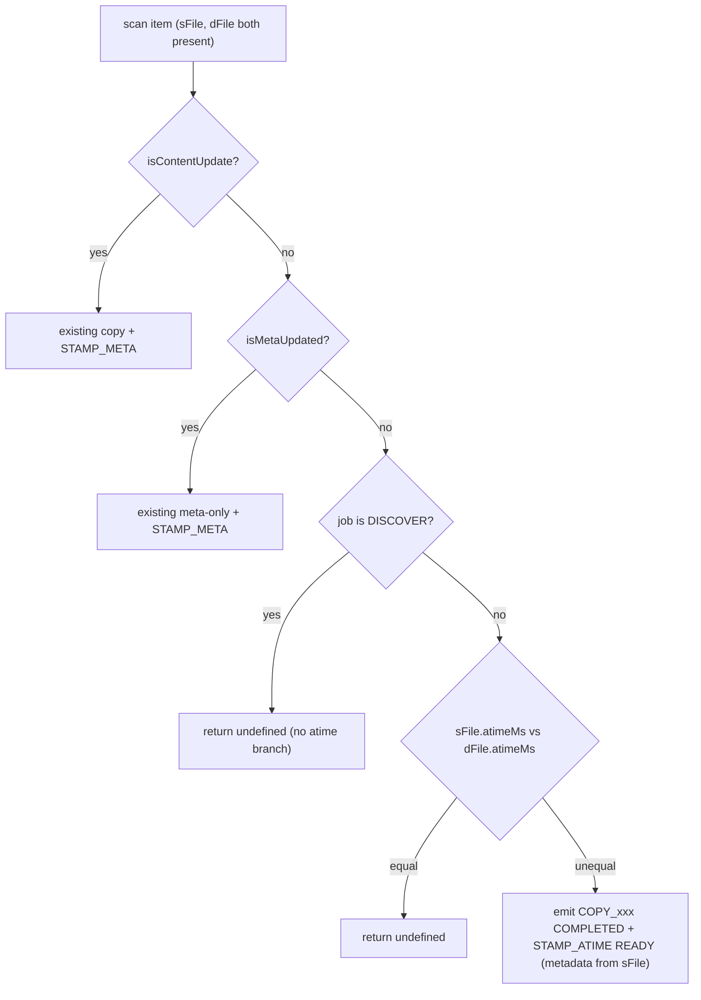

## Context

`MigrateScanService.buildCommand` compares source and destination `Stats` from `lstat`. If `isContentUpdate` is true, it emits copy + `STAMP_META`. Else if `isMetaUpdated` is true, it emits copy-as-completed + `STAMP_META`. Otherwise it returns **`undefined`**, so no work runs even when **`atimeMs`** differs.

Helpers live in `services/worker/src/activities/utils/utils.ts` (`isContentUpdate`, `isMetaUpdated`). Stamp execution remains in `StampMetaService` (`stampAccessAndModifiedTime` uses `command.metadata.atime` / `mtime`).

## Goals / Non-Goals

**Goals:**

- When **no** content update and **no** metadata update is required and destination exists, detect **`atimeMs` ≠ `atimeMs`** (source vs destination) and emit a command that results in destination timestamps being aligned with **source** metadata from the scan snapshot.
- Gate the feature to **non-discovery** migration flows only.
- Keep **`preserveAccessTime`** unrelated to whether this branch runs.
- Provide a **dedicated atime-only operation** so an atime-only restamp does not redo chmod / chown / ACL on every drift event.
- Apply the same logic uniformly across **NFS** and **SMB** workers and across **files**, **directories**, and **symlinks**.

**Non-Goals:**

- Replacing existing stamp ordering for content/metadata change paths.
- Introducing a separate tolerance for atime unless product later requires it (initial design: **strict inequality** on `atimeMs`).

## Decisions

| Decision | Rationale |
|----------|-----------|
| **Third branch in `buildCommand`** | Minimal change; preserves order: content first, metadata second, atime-only third. |
| **Strict `atimeMs` comparison** | Matches user spec; avoids masking real drift. Optional ε can be a follow-up if false positives appear on SMB/NFS. |
| **Dedicated `OPS_CMD.STAMP_ATIME` op** | Reusing `STAMP_META` redoes chmod / chown / ACL on every atime-only drift. A separate op keeps the path to a single `utimes`/`lutimes` syscall — the performance win promised by R3 / R4. |
| **Defensive re-check at execution** | Cheap `lstat` before `utimes` covers stale scan data and idempotent retries; skip the syscall and mark op `COMPLETED` when destination already aligned. |
| **`StampAtimeService` runs `preserveAccessAndModifiedTime` in parallel when option enabled** | Keeps source preservation behavior consistent with `STAMP_META` and confirms R5 (`preserveAccessTime` independence is about gating, not about whether preservation runs). |
| **Reuse `ItemInfo.stampMetaDataStatus` column** | No Liquibase migration; db-writer needs no awareness of the new op enum. |
| **Job-type / phase gating at scan caller** | `buildCommand` may not receive `jobContext` today; pass `jobType` (or `isDiscovery: boolean`) from `commandGenerationService` / scan input so DISCOVER is excluded without scattering string checks. |
| **Symlinks** | Use same `lstat` + metadata `isSymLink` path as existing commands so `lutimes` vs `utimes` remains consistent in both `StampMetaService` and the new `StampAtimeService`. |
| **No Go SMB worker changes** | `go-smb-worker/` is README-only; SMB execution is handled by the TS worker on Windows via UNC paths. |

### Sequence — scan (per item, non-discovery migrate)



### Sequence — execution (atime-only command)

```mermaid
sequenceDiagram
    participant CES as CommandExecService
    participant SAS as StampAtimeService
    participant SMS as StampMetaService
    participant FS as Node fs (utimes / lutimes / lstat)
    participant Stream as JobContext error stream

    CES->>SAS: stampAtime(command, jobContext, targetPath, sourcePath)
    SAS->>SAS: check ops[STAMP_ATIME] present and not COMPLETED
    SAS->>FS: lstat(targetPath)
    alt target.atimeMs == metadata.atime
        SAS-->>CES: skip; mark STAMP_ATIME COMPLETED
    else mismatch
        par destination stamp
            SAS->>FS: utimes / lutimes (targetPath, atime, mtime)
        and optional source preserve
            SAS->>SMS: preserveAccessAndModifiedTime(sourcePath) (only if preserveAccessTime=true)
        end
        alt no errors
            SAS-->>CES: mark STAMP_ATIME COMPLETED
        else error
            SAS->>Stream: dmError(Origin.DESTINATION, Operation.STAMP_TIME, ...)
            SAS-->>CES: mark STAMP_ATIME ERROR
        end
    end
```

## Protocol coverage (NFS + SMB)

| Surface | NFS (Linux worker) | SMB (Windows worker, UNC) |
|---------|--------------------|---------------------------|
| File atime stamp | `fs.promises.utimes` | `fs.promises.utimes` over UNC |
| Directory atime stamp | `fs.promises.utimes` | `fs.promises.utimes` over UNC (SMB granularity varies) |
| Symlink atime stamp | `fs.promises.lutimes` | `fs.promises.lutimes` over UNC |
| Source preserve (when option enabled) | `utimes` / `lutimes` on source mount | `utimes` / `lutimes` on source mount |
| ACL / chmod / chown | NOT touched by new op | NOT touched by new op |

## Test design

| Tier | Runner | Connectivity | Purpose |
|------|--------|--------------|---------|
| Unit | Jest `*.spec.ts` (mocked `fs`) | None | Input validation, branch selection, error propagation |
| Component | Jest `*.component.spec.ts` (real `os.tmpdir()` files) | None | Real `utimes`/`lutimes` behavior on files, directories, symlinks, idempotency |
| E2E | Ginkgo v2 + Gomega (`ndm-api-tests/tests/e2e/TC-XXX-atime-reconcile_test.go`) | Real SMB / NFS shares via `--protocol_type` | Discovery (negative) + migration + incremental + cutover, atime mismatch + match, with `preserveAccessTime` on/off |

A new helper `ndm-api-tests/utils/atime_manager.go` (modeled on `permissions_manager.go`) provides `SetSourceAtime`, `GetAtime`, and assertions for SMB (PowerShell `Set-ItemProperty LastAccessTime`) and NFS (`touch -a -t`, `stat -c %X`) via the existing SSH worker harness.

## Risks / Trade-offs

| Risk | Mitigation |
|------|------------|
| Extra commands on every incremental when atime never stabilizes | Acceptable if mismatch rare; monitor command volume via `MetricsService.METRIC.STAMP_ATIME`. |
| `stat` during scan updates source atime on some mounts | Document; same class of issue as other preserve-atime discussions; out of scope for this change unless measured. |
| Windows / SMB time granularity | Strict ms compare may still see spurious mismatch or miss drift; add tests on representative shares. |
| Stamp applies **mtime** with **atime** via `utimes` | Metadata carries both from source; when content path skipped, mtime already matched by `isContentUpdate` — restamp is consistent. |
| Defensive re-check adds an `lstat` per atime-only command | Cheap on local mounts; on SMB it doubles round-trips. Acceptable for correctness; can be made optional via config if measured to hurt throughput. |
| `STAMP_ATIME` and `STAMP_META` mapped to the same `stampMetaDataStatus` column | Reduces observability granularity. Document; revisit if reports require separate counters. |

## Migration Plan

- Deploy worker with new scan logic + new `StampAtimeService`; no DB migration.
- Rollback: revert worker change; no persisted schema dependency. Commands previously emitted with `STAMP_META` for atime-only drift were valid (just heavier); reverting just changes their shape going forward.

## Open Questions

- Exact **job type** enum / string values for "non-discovery" in worker config (reuse existing `jobType` on context — `MIGRATE`, `CUT_OVER`, etc.).
- Whether to add optional **atime tolerance ms** later without breaking strict mode tests.
- Whether to add a dedicated `stamp_atime_status` inventory column for observability (currently folded into `stampMetaDataStatus`).
