# Attack Surface Map

Static review baseline: source references in this audit point at commit `53ffaf744457d63743694e2bb2acdbeb86889e89`.

```mermaid
flowchart LR
  User([Browser / API client])
  Worker([NDM worker])
  Operator([Privileged operator / config manager])
  MQ([RabbitMQ / Temporal / Redis / RMQ])
  Env([Runtime env / local files / deployment assets])

  subgraph Network
    AS001[AS-001 Admin identity APIs]
    AS002[AS-002 Admin worker registration]
    AS003[AS-003 Admin upgrade APIs]
    AS004[AS-004 Config server management APIs]
    AS005[AS-005 Config path upload APIs]
    AS006[AS-006 Config support-bundle APIs]
    AS007[AS-007 Config work-manager APIs]
    AS008[AS-008 Jobs jobconfig APIs]
    AS009[AS-009 Jobs jobrun APIs]
    AS010[AS-010 Jobs worker/task APIs]
    AS011[AS-011 Worker stats callback]
    AS012[AS-012 Reports discovery HTTP APIs]
    AS013[AS-013 Reports discovery RMQ consumer]
    AS014[AS-014 Reports/PDF/job-run APIs]
    AS015[AS-015 Reports ASUP APIs]
    AS016[AS-016 DB-writer consumer API]
    AS017[AS-017 Shared auth headers]
  end

  subgraph Filesystem
    AS018[AS-018 Jobs mount tracker file writes]
    AS019[AS-019 Support log collection / ZIP paths]
    AS020[AS-020 Upgrade bundle extraction / staging]
    AS021[AS-021 Repo local scripts & templates]
  end

  subgraph Process
    AS022[AS-022 Worker protocol command templates]
    AS023[AS-023 Isilon DNS shell helpers]
    AS024[AS-024 Upgrade command runners]
  end

  subgraph Config
    AS025[AS-025 Runtime env & config readers]
  end

  subgraph Inter-service
    AS026[AS-026 Worker secret-fetch HTTP client]
    AS027[AS-027 Support workflow callback chain]
    AS028[AS-028 Redis / Temporal JSON payloads]
    AS029[AS-029 Isilon management API clients]
  end

  User --> AS001
  User --> AS003
  User --> AS004
  User --> AS005
  User --> AS006
  User --> AS008
  User --> AS009
  User --> AS010
  User --> AS012
  User --> AS014
  User --> AS015
  Worker --> AS011
  Worker --> AS016
  Worker --> AS026
  Worker --> AS027
  Operator --> AS004
  Operator --> AS018
  Operator --> AS022
  Operator --> AS023
  Operator --> AS024
  Operator --> AS029
  MQ --> AS013
  MQ --> AS027
  MQ --> AS028
  Env --> AS018
  Env --> AS019
  Env --> AS020
  Env --> AS021
  Env --> AS025
```

| ID | Entry Point | File:Line | Category | Trust Boundary | Notes |
| --- | --- | --- | --- | --- | --- |
| AS-001 | Admin identity/auth/resource REST controllers (`about-ndm`, `accounts`, `auth`, `permissions`, `projects`, `roles`, `role-permissions`, `setting`, `users`, `user-roles`) | `services/admin-service/src/about-ndm/about-ndm.controller.ts:18` `services/admin-service/src/account/account.controller.ts:33` `services/admin-service/src/auth/auth.controller.ts:19` `services/admin-service/src/permission/permission.controller.ts:22` `services/admin-service/src/project/project.controller.ts:28` `services/admin-service/src/role/role.controller.ts:21` `services/admin-service/src/role-permission/role-permission.controller.ts:28` `services/admin-service/src/setting/setting.controller.ts:8` `services/admin-service/src/user/user.controller.ts:27` `services/admin-service/src/user-role/user-role.controller.ts:33` | Network | Browser/API client → admin-service JSON DTOs + headers | CRUD endpoints for tenant, RBAC, and user lifecycle. |
| AS-002 | Admin worker-registration API | `services/admin-service/src/worker-registration/worker-registration.controller.ts:17` | Network | Browser/API client → admin-service | Registers worker identities and client credentials. |
| AS-003 | Admin upgrade APIs (`init`, `chunk-upload`, `process-upload`, `trigger-upgrade`, `multicast`, `execute`, worker acks) | `services/admin-service/src/upgrade/upgrade.controller.ts:48` | Network | Browser/API client / worker callbacks → admin-service | Handles binary uploads, bundle metadata, worker upgrade execution, and acknowledgements. |
| AS-004 | Config `servers` APIs (`create`, `update`, `fetch-certificate`, `fetch-zones`, `validate-connection`) | `services/config-service/src/configurations/configuration.controller.ts:12` | Network | Browser/API client → config-service | Accepts storage credentials, hosts, TLS certificates, SmartConnect metadata, and project IDs. |
| AS-005 | Config path-upload APIs (`POST :fileServerId`, `POST confirm/:uploadId`, worker `PATCH`, CSV `GET download`) | `services/config-service/src/path-upload/path-upload.controller.ts:15` | Network / Filesystem | Browser/API client / worker → config-service | Accepts CSV contents in request bodies and emits generated CSVs to `/uploads`. |
| AS-006 | Config support-bundle APIs (`POST`, `GET is-bundle-ready`, `GET download`, `POST send`, `POST workflow-status-update`) | `services/config-service/src/support-bundle/support-bundle.controller.ts:29` | Network | Browser/API client / internal callback → config-service | User requests become workflow payloads; workflow status update is a state-changing callback route. |
| AS-007 | Config work-manager APIs | `services/config-service/src/work-manager/work-manager.controller.ts:29` | Network | Browser/API client → config-service | Validation/orchestration endpoints for path and worker operations. |
| AS-008 | Jobs jobconfig APIs (bulk create/update/delete + `POST /jobs/get-dirs`) | `services/jobs-service/src/jobconfig/jobconfig.controller.ts:27` | Network | Browser/API client → jobs-service | Uses file-server metadata and request body fields to mount and list remote directories. |
| AS-009 | Jobs jobrun APIs | `services/jobs-service/src/jobrun/jobrun.controller.ts:42` | Network | Browser/API client → jobs-service | Starts job runs, retries, incident views, unresolved error queries, and state mutations. |
| AS-010 | Jobs worker/task list APIs | `services/jobs-service/src/workers/workers.controller.ts:9` `services/jobs-service/src/tasks/tasks.controller.ts:7` | Network | Browser/API client → jobs-service | Reads worker status and task data keyed by user-controlled identifiers. |
| AS-011 | Worker stats callback (`POST /statscheck/`) | `services/jobs-service/src/healthcheck/healthcheck.controller.ts:22` | Network | Worker → jobs-service | Workers submit health metrics and identity claims through `AuthWorker()`. |
| AS-012 | Reports discovery HTTP APIs (`inventory`, downloads, prepared token flow, worker report generation) | `services/reports-service/src/discovery/discovery.controller.ts:18` | Network | Browser/API client / worker → reports-service | Accepts job IDs, file-server IDs, parent paths, report types, and download tokens. |
| AS-013 | Reports discovery RMQ consumer (`Pattern.DISCOVERY_COMPLETED`) | `services/reports-service/src/discovery/discovery.controller.ts:242` | Inter-service | RMQ publisher → reports-service | Consumes discovery-completed messages and turns them into report generation work. |
| AS-014 | Reports PDF / overview / reports / job-run HTTP APIs | `services/reports-service/src/pdf/pdf.controller.ts:12` `services/reports-service/src/overview/overview.controller.ts:7` `services/reports-service/src/reports/reports.controller.ts:17` `services/reports-service/src/job-run/job-run.controller.ts:36` | Network | Browser/API client → reports-service | Reads job IDs and report parameters, generates files, and streams output. |
| AS-015 | Reports ASUP APIs (`GET settings`, `PUT settings`, `POST support-bundle/send`) | `services/reports-service/src/asup/asup.controller.ts:29` | Network | Browser/API client / internal HTTP caller → reports-service | Accepts ASUP settings and support-bundle file names for outbound transmission. |
| AS-016 | DB-writer consumer bootstrap API (`POST /redis-consumer/start`) | `services/db-writer/src/redis-consumer/redis-consumer.controller.ts:8` | Network | Internal HTTP caller / network peer → db-writer | Hidden from Swagger but intentionally unauthenticated; starts background Redis consumers. |
| AS-017 | Shared auth guards reading `Authorization` and `projectId` headers | `lib/auth-lib/src/auth/JwtAuthGuard.ts:20` `lib/auth-lib/src/auth/jwtWorkerAuthGuard.ts:19` | Network | Every protected HTTP route → auth-lib | Authorization depends on JWT claims plus caller-supplied `projectId` header for project scoping. |
| AS-018 | Jobs mount tracker file writes (`/tmp` credential files, `/etc/hosts`, `/etc/krb5.conf`, mount directories) | `services/jobs-service/src/jobconfig/mount-tracker.service.ts:649` `services/jobs-service/src/jobconfig/mount-tracker.service.ts:867` `services/jobs-service/src/jobconfig/mount-tracker.service.ts:969` | Filesystem | Job config data / DB file-server data → local host filesystem | Remote storage metadata changes privileged local files before SMB/NFS mount operations. |
| AS-019 | Support log collection and ZIP output paths | `services/support-service/src/activities/log-generator/log-generator.activity.ts:18` `services/support-service/src/config/app.config.ts:8` | Filesystem | Workflow payload + env config → support-service filesystem | Date range, worker IDs, and env-configured paths determine what gets zipped and where. |
| AS-020 | Upgrade bundle extraction/staging | `services/admin-service/src/upgrade/upgrade.controller.ts:68` `services/worker/src/activities/upgrade/binary-handler.interface.ts:86` | Filesystem | Uploaded bundle bytes / worker downloads → local staging directories | Handles chunked uploads, archive extraction, checksum verification, and staged script placement. |
| AS-021 | Repo-local shell scripts and env templates | `services/keycloak-customizations/create-cru.sh:4` `services/worker/.env.template:17` | Filesystem / Config | Developer/operator → local scripts and env files | Local setup artifacts embed credentials and command templates that can bleed into runtime habits. |
| AS-022 | Worker protocol command payloads and env-defined command templates | `services/worker/src/protocols/protocol/protocol.ts:34` `services/worker/src/config/command.config.ts:55` | Process | Job payload / file-server credentials / env command strings → shell | Hostnames, usernames, passwords, paths, and protocol versions are interpolated into shell commands. |
| AS-023 | Isilon DNS shell helpers on Windows | `services/config-service/src/storage-clients/isilon/isilon-storage-client.ts:806` `services/worker/src/storage-clients/isilon/isilon-storage-client.ts:861` | Process | SmartConnect SSIP / DNS zone → PowerShell / `netsh` | SmartConnect metadata is concatenated into Windows shell commands. |
| AS-024 | Upgrade command runners (control plane and worker) | `services/admin-service/src/upgrade/upgrade.service.ts:1713` `services/worker/src/activities/upgrade/handlers/linux-binary.handler.ts:79` `services/worker/src/activities/upgrade/handlers/windows-binary.handler.ts:76` | Process | Bundle version / staging paths → shell/systemd/process spawn | Detached upgrade execution uses string-built shell commands or spawned PowerShell. |
| AS-025 | Runtime env and config readers | `services/jobs-service/src/config/app.config.ts:7` `services/config-service/src/config/app.config.ts:7` `services/support-service/src/config/app.config.ts:8` `services/reports-service/src/config/app.config.ts:7` `services/worker/src/config/app.config.ts:10` `services/worker/src/config/command.config.ts:55` `lib/logger-lib/src/config/logger.config.ts:23` | Config | Container env / config maps / local env files → service runtime | Reads service URLs, DB/Redis/Temporal endpoints, mount command templates, log settings, and upgrade paths. |
| AS-026 | Worker secret-fetch HTTP client | `services/worker/src/redis/redis.service.ts:80` | Inter-service | Worker → config/secret endpoint | Worker bootstraps Redis credentials from `WORKER_CONFIG_URL` and bearer auth. |
| AS-027 | Support workflow callback chain | `services/support-service/src/activities/notify-config/notify-config.activity.ts:23` | Inter-service | Support workflow → config-service callback | Posts bundle status updates to config-service without an auth envelope. |
| AS-028 | Redis / Temporal JSON payload deserializers | `lib/jobs-lib/src/datatype/stream-datatypes.ts:62` `services/config-service/src/workflow/workflow.service.ts:127` | Inter-service | Redis stream / Temporal history payloads → application objects | Queue/history bytes are `JSON.parse`d into domain objects with minimal schema enforcement. |
| AS-029 | Isilon management API clients | `services/config-service/src/storage-clients/isilon/isilon-storage-client.ts:625` `services/worker/src/storage-clients/isilon/isilon-storage-client.ts:680` | Inter-service / Network | Configured management host/port/user/pass/cert → HTTPS | The app talks directly to external storage-management planes with supplied credentials and certs. |
